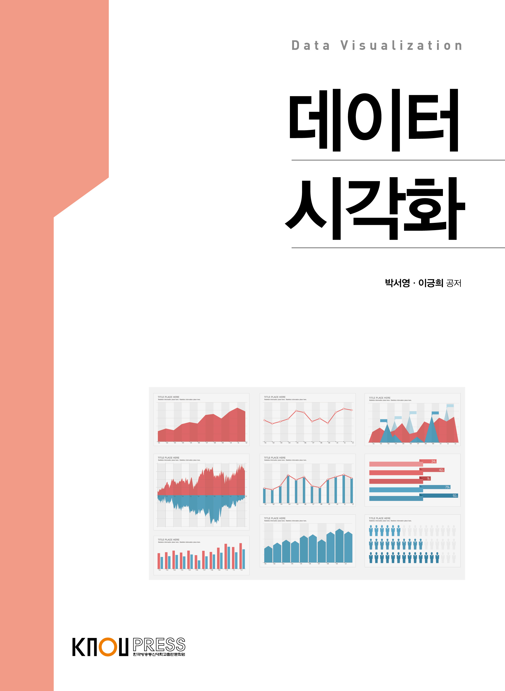

# 데이터시각화 (Data Visualization)

`R` `ggplot2` `ggraph`

## 개요

이 저장소는 **데이터시각화** 학습 내용을 정리하고 있습니다.

> 저자 : 박서영·이긍희

## 학습 목표
본 교과목은 좋은 데이터 시각화를 위해 알아두어야 할 시각화의 기본 요소를 학습하고, 널리 쓰이는 다양한 데이터 시각화 기법에서 이러한 기본 요소들이 어떤 역할을 하고 있는지 살펴보며, R 프로그램을 이용하여 새로운 데이터를 효과적이고 효율적으로 시각화할 수 있는 능력을 기르는 것을 목표로 한다.

## 학습 내용

| 챕터 | 챕터명 | 핵심 학습 내용 |
|------|--------|----------|
| 1    | 예제1  | 내용1    |
| 2    | 예제2  | 내용2    |
| 3    | 예제3  | 내용3    |
