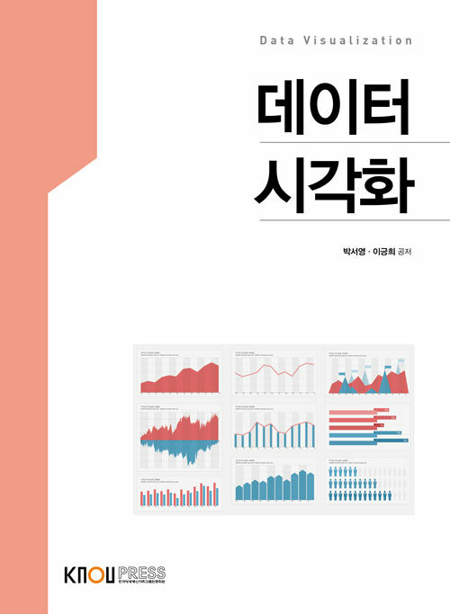

# 데이터시각화 (Data Visualization)

`R` `ggplot2` `ggraph`

## 개요

이 저장소는 **데이터시각화** 학습 내용을 정리하고 있습니다.

> 저자 : 박서영·이긍희

## 학습 목표
- 시각화의 기본 요소 학습
- 다양한 데이터 시각화 기법
- 효과적/효율적인 데이터 시각화

## 학습 내용

| 챕터 | 챕터명 | 핵심 학습 내용 |
|------|--------|----------|
| 1    | 예제1  | 내용1    |
| 2    | 예제2  | 내용2    |
| 3    | 예제3  | 내용3    |
